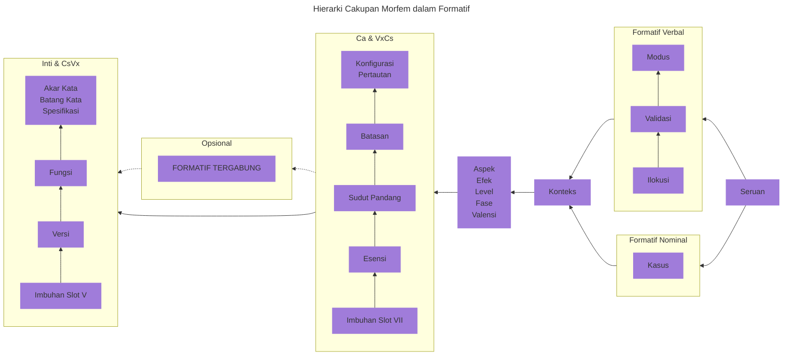

## 2.0 Morfofonologi {#Sec2}

Morfofonologi merujuk pada bagaimana suatu bahasa menggunakan fonem (bunyi yang bermakna) dan fitur fonologisnya (misal, penekanan suku kata, geminasi, nada, dll.) untuk menghasilkan pola pembentukan kata dan kategori morfologis (misal, tunggal versus jamak, kala verba, dll.) yang diterapkan pada kata-kata.

::: info Kelas Kata

Terdapat tiga jenis kata dalam bahasa Ithkuil Baru: **formatif**, **adjung**, dan **referensial**. Formatif merupakan kelas kata yang umumnya sesuai dengan kata benda dan kata kerja dalam bahasa manusia alami. (Pada [Bagian 2.4.2](02#Sec2_4_2) di bawah ini, kita akan melihat mengapa masuk akal untuk menggabungkan kata benda dan kata kerja menjadi satu jenis kata dalam tata bahasa Ithkuil Baru.) Adjung adalah kata “pembantu” yang beroperasi bersama dengan formatif untuk memberikan informasi semantik lebih lanjut tentang formatif yang berdekatan. Referensial adalah jenis kata yang beroperasi mirip dengan kata ganti dalam bahasa manusia alami, meskipun kita akan melihat bahwa penggunaannya lebih dinamis dan luas daripada rentang kata ganti biasa dalam bahasa lain.

:::

::: info Tipologi Tata Bahasa

Bahasa Ithkuil Baru pada dasarnya adalah bahasa aglutinatif dan secara sekunder merupakan bahasa sintetis. Ini berarti bahwa cara pembentukan akar kata, infleksi, dan derivasi morfosemantik, serta bagaimana elemen-elemen tersebut, tergabung secara bermakna menjadi kata-kata, terutama melalui penggabungan satu atau lebih imbuhan (termasuk prefiks, sufiks, dan infiks) ke akar semantik, di mana imbuhan itu sendiri sangat sintetis (yaitu, menggabungkan banyak kategori morfologis menjadi satu bentuk fonologis). Pada dasarnya, ini berarti bahwa kata-kata dalam bahasa Ithkuil Baru dibentuk dengan menggabungkan beberapa imbuhan ke akar kata inti, di mana setiap imbuhan dapat memuat banyak elemen makna di dalamnya.

:::

## 2.1 Urutan Bentuk Vokal Standar {#Sec2_1}

Saat kita meneliti bagaimana struktur kata-kata dalam bahasa Ithkuil Baru, kita akan melihat bahwa struktur kata beroperasi melalui serangkaian “slot” berurutan, di mana setiap slot diisi dengan imbuhan. Kemudian kita akan melihat bahwa banyak imbuhan komponen yang digunakan untuk mengisi slot-slot ini mengandung pola sembilan vokal yang sering muncul, atau merupakan matriks dengan banyak nilai di mana satu sumbu matriks membawa sembilan bentuk vokal. Akibatnya, bahasa ini menggunakan pola umum standar dari sembilan bentuk vokal dalam beberapa rangkaian, yang kemudian dapat digunakan untuk mengisi setiap Slot yang berbeda ini. Pola umum standar vokal ini memfasilitasi penghafalan sejumlah besar imbuhan oleh orang-orang yang ingin mencoba mempelajari bahasa tersebut.

Tabel di bawah ini menampilkan berbagai pola dari “Urutan Bentuk Vokal Standar” ini. Pembaca akan merasa bermanfaat untuk merujuk kembali ke bagan ini ketika memeriksa banyak slot morfologis berbeda yang digunakan dalam pembentukan kata Ithkuil Baru. Terlepas dari jumlah bentuk vokal, struktur urutannya cukup sistematis jika dianalisis secara cermat.

    <table>
        <caption>Urutan Bentuk Vokal Standar</caption>
        <thead>
            <tr>
                <th>Bentuk</th>
                <th>Seri 1</th>
                <th>Seri 2</th>
                <th>Seri 3&#42;</th>
                <th>Seri 4</th>
            </tr>
        </thead>
        <tbody>
            <tr>
                <th>1</th>
                <td>a</td>
                <td>ai</td>
                <td>ia / uä</td>
                <td>ao</td>
            </tr>
            <tr>
                <th>2</th>
                <td>ä</td>
                <td>au</td>
                <td>ie / uë</td>
                <td>aö</td>
            </tr>
            <tr>
                <th>3</th>
                <td>e</td>
                <td>ei</td>
                <td>io / üä</td>
                <td>eo</td>
            </tr>
            <tr>
                <th>4</th>
                <td>i</td>
                <td>eu</td>
                <td>iö / üë</td>
                <td>eö</td>
            </tr>
            <tr>
                <th>5</th>
                <td>ëi</td>
                <td>ëu</td>
                <td>eë</td>
                <td>oë</td>
            </tr>
            <tr>
                <th>6</th>
                <td>ö</td>
                <td>ou</td>
                <td>uö / öë</td>
                <td>öe</td>
            </tr>
            <tr>
                <th>7</th>
                <td>o</td>
                <td>oi</td>
                <td>uo / öä</td>
                <td>oe</td>
            </tr>
            <tr>
                <th>8</th>
                <td>ü</td>
                <td>iu</td>
                <td>ue / ië</td>
                <td>öa</td>
            </tr>
            <tr>
                <th>9</th>
                <td>u</td>
                <td>ui</td>
                <td>ua / iä</td>
                <td>oa</td>
            </tr>
        </tbody>
    </table>

\* Ketika didahului oleh **y**-, bentuk Seri 3 yang dimulai dengan -**i** gunakan bentuk alternatifnya sebagai gantinya (misal, **yuä**, bukan **yia**), sementara bentuk Seri 3 yang dimulai dengan -**u** menggunakan bentuk alternatifnya jika didahului oleh **w**- (misal, **wiä**, bukan **wua**).

## 2.2 Aturan untuk Memasukkan Hentian Glotal ke dalam Bentuk Vokal {#Sec2_2}

Saat kita meneliti pembentukan kata, kita akan melihat bahwa beberapa slot morfofonologis yang membentuk struktur suatu bentuk dalam bahasa memerlukan penyisipan hentian glotal ke dalam bentuk vokal V. Untuk melakukannya, ikuti aturan di bawah ini:

1. Jika **V** adalah vokal tunggal atau diftong, hentian glotal ditempatkan setelah **V**, misal, -**a** menjadi -**a’**, -**ai** menjadi -**ai’**.
2. Jika **V** adalah konjung dwisuku kata, letakkan infiks di antara dua suku kata **V**, misal, -**ua** menjadi -**u’a**.
3. Ketika menerapkan aturan 1 di atas, jika infiks menghasilkan konjung yang secara fonotaktik tidak diperbolehkan atau secara eufonik tidak diinginkan, atau menghasilkan hentian glotal di posisi akhir kata, maka vokal epentetik harus ditambahkan sebagai berikut:
    * Jika **V** adalah vokal tunggal, gandakan vokal ini setelah hentian glotal; misal, -**a** menjadi -**a’a**.
    * Jika **V** adalah diftong, maka letakkan hentian glotal di antara dua vokal diftong tersebut (sebagai pengecualian terhadap Aturan 1 di atas); misal, -**ai** menjadi -**a’i** alih-alih -**ai’** yang biasa.
4. [Catatan Khusus di Bagian 4.6](04#Sec4_6) akan menjelaskan bagaimana, dalam keadaan tertentu, hentian glotal pada imbuhan Slot IX `Vc` dapat digeser ke Slot kata yang berbeda sama sekali, untuk memperpendek jumlah suku kata dalam kata tersebut.

## 2.3 Struktur Formatif {#Sec2_3}

Struktur morfologi suatu formatif dapat ditunjukkan dengan rumus berikut:

::: center

<code>(Cc + Vv) + Cr + Vr + ( CsVx ... ) + Ca + ( VxCs ... ) + ( VnCn ) + Vc / Vk + [PENEKANAN]</code>

:::

Di mana, dengan pengecualian `Cr` dan [PENEKANAN], setiap istilah mengacu pada imbuhan yang terdiri dari bentuk konsonan (ditunjukkan dalam rumus sebagai **C**), bentuk vokal (ditunjukkan sebagai **V**), atau kombinasi keduanya (misal, <code>CsVx</code> atau <code>VnCn</code>). Istilah `Cr` mengacu pada akar kata itu sendiri, bentuk konsonan yang terdiri dari satu hingga lima konsonan. Seperti yang ditunjukkan oleh berbagai tanda kurung, beberapa istilah dalam rumus bersifat opsional, sehingga beberapa formatif terdiri dari minimal lima istilah: <code>Cr + Vr + Ca + Vc / Vk + [PENEKANAN]</code>. Berbagai elemen morfologis ini harus muncul dalam urutan sekuensial tertentu, dan dengan demikian dapat dianalisis sebagai pengisian sepuluh "slot" morfologis. Slot-slot ini diberi label secara berurutan sebagai Slot I hingga Slot X, seperti yang ditunjukkan pada bagan berikut.

<!-- @include: struct.md{1-156} -->

Struktur morfologis spesifik dan fungsi semantik dari masing-masing slot ini akan dibahas secara individual di bab-bab khusus dalam dokumen ini. Berikut ini adalah gambaran umum pendahuluan dari setiap slot.

::: tabs

@tab I

`Cc`

Slot ini diisi oleh hentian glotal **’**-, **h**-, atau bentuk dwikonsonan yang dimulai dengan **h**- (misal, **hw**-, **hr**-, **hm**-, dll.). Ini menunjukkan apakah formatif tersebut merupakan formatif berdiri sendiri (tidak tergabung), formatif tergabung Tipe 1, atau formatif tergabung Tipe 2. Penggabungan formatif dibahas dalam [Bagian 10.1](10#Sec10_1). Ini juga menunjukkan apakah Slot II di bawah ini berisi informasi “pintasan” untuk Slot IV dan VI (sehingga Slot IV dan VI dapat dihilangkan, sehingga memperpendek kata).

@tab II

`Vv`

Berisi salah satu dari 32 bentuk vokal berbeda yang menunjukkan Batang Kata dan Versi formatif. Terdapat empat batang kata yang terkait dengan setiap akar kata; batang kata dibahas dalam [Bagian 2.4.3.](02#Sec2_4_3). Terdapat dua Versi untuk setiap pembentuk, PROSESUAL dan KOMPLETIF, yang dibahas dalam [Bagian 3.7](03#Sec3_7). Selain itu, slot ini dapat berisi informasi “pintasan” untuk Slot IV dan VI (sehingga Slot IV dan VI dapat dihilangkan, sehingga mempersingkat kata). Slot ini juga berfungsi dalam keadaan tertentu sebagai sarana “pintasan” untuk menyampaikan salah satu dari tiga imbuhan Slot VII yang telah dipilih sebelumnya.

@tab III

`Cr`

Ini adalah bentuk konsonan yang terdiri dari satu hingga lima konsonan, yang menunjukkan akar semantik dari formatif, yang dibahas dalam [Bagian 2.4](02#Sec2_4).

@tab IV

`Vr`

Berisi salah satu dari 32 bentuk vokal yang menunjukkan Fungsi, Spesifikasi, dan Konteks Formatif. Terdapat dua fungsi: STATIF dan DINAMIS, yang dibahas dalam [Bagian 3.8](03#Sec3_8). Terdapat empat Spesifikasi: DASAR, KONTENSIAL, KONSTITUTIF, dan OBJEKTIF, yang dibahas dalam [Bagian 2.4.4](02#Sec2_4_4). Terdapat empat Konteks: EKSISTENSIAL, FUNGSIONAL, REPRESENTASIONAL, dan AMALGAMATIF, yang dibahas dalam [Bagian 3.9](03#Sec3_9).

@tab V

(`CsVx` ... )

Berisi satu atau lebih imbuhan deskriptif berbentuk bentuk konsonan + bentuk vokal yang berlaku pada akar kata itu sendiri (bukan pada kata secara keseluruhan). Setiap imbuhan hadir dalam tiga jenis: situasional, derivasional, atau terbatas. Terdapat lebih dari 400 imbuhan seperti itu yang tersedia, dijelaskan dalam [Bab 7](07).

@tab VI

`Ca`

Imbuhan konsonan gabungan wajib yang menunjukkan lima kategori berikut: Konfigurasi, Pertautan, Batasan, Sudut Pandang, dan Esensi. Kategori-kategori ini semuanya dibahas dalam [Bab 3](03). Pembentukan kompleks imbuhan <code>Ca</code> itu sendiri dibahas dalam [Bagian 3.6](03#Sec3_6).

@tab VII

`VxCs`

Berisi satu atau lebih imbuhan deskriptif berbentuk bentuk vokal + bentuk konsonan yang berlaku untuk kombinasi akar kata dan kategori Slot VI <abbr>Ca</abbr> (bukan hanya akar kata saja). Kecuali pembalikan bentuk konsonan dan bentuk vokal, imbuhan ini sama dengan yang digunakan di Slot V.

@tab VIII

`VnCn`

Suatu imbuhan yang terdiri dari bentuk vokal + bentuk konsonan yang menyampaikan Modus atau Cakupan Kasus, ditambah Aspek, Fase, Tingkat, atau Efek. Penjelasan semua kategori ini adalah subjek [Bab 5](05).

@tab IX

`Vc` / `Vf` / `Vk`

Imbuhan bentuk vokal yang, tergantung pada pola penekanan yang ditunjukkan pada Slot X, menyampaikan Kasus formatif, Format formatif, atau kombinasi dari dua kategori: Ilokusi + Validasi. Kasus dibahas dalam [Bab 4](04); Format dalam [Bagian 10.1](10#Sec10_1), dan Ilokusi dan Validasi dalam [Bab 6](06).

@tab X

`[PENEKANAN]`

Pola penekanan suku kata menentukan jenis imbuhan apa yang ditampilkan di Slot IX sebelumnya. Hal ini dibahas di [Bagian 6.2.1](06#Sec6_2_1).

:::

### Hierarki Cakupan Morfem dalam Formatif

Struktur slot pada formatif kata kurang lebih mencerminkan hierarki morfem dalam suatu formatif, yaitu urutan di mana informasi semantik setiap morfem memiliki cakupan atas morfologi sebelumnya saat kata tersebut secara berurutan terungkap dalam ucapan atau tulisan. Urutan cakupan ini ditunjukkan di bawah ini:

Sebelum menganalisis detail setiap Slot individual dari rumus morfologi di atas, penting untuk terlebih dahulu memahami bagaimana akar dan batang kata dari setiap formatif bekerja. Hal ini dijelaskan secara rinci di bagian selanjutnya di bawah ini.

## 2.4 Formasi Akar dan Batang Kata {#Sec2_4}

Semua kata dalam bahasa Ithkuil <ins>Baru</ins> yang diterjemahkan ke dalam bahasa Inggris sebagai kata benda atau kata kerja didasarkan pada sebuah batang kata, yang pada gilirannya berasal dari akar kata yang abstrak secara semantik. Proses ini dijelaskan di bagian-bagian di bawah ini.

<!-- @include: struct.md{157-312} -->

### 2.4.1 Akar Kata {#Sec2_4_1}

Akar kata membentuk dasar semantik yang mana batang kata kata benda/kata kerja sebenarnya diturunkan. Akar kata terdiri dari bentuk konsonan, `Cr`, yang menempati Slot III dalam rumus morfologi di atas. Akar kata terdiri dari satu hingga lima konsonan (misal, -**k**-, -**st**-, -**ntr**-, -**pstw**-, -**rmzgl**-). Batasan fonotaktik (lihat [Bagian 1.5](01#Sec1_5)) dari bahasa ini memungkinkan lebih dari 33.000 kemungkinan akar kata.

Akar kata adalah unit semantik dasar. Misalnya, akar kata -**DN**- adalah akar kata yang rujukan semantiknya adalah ‘NAMA/SEBUTAN/LABEL’. Batang kata fungsional (atau hanya batang kata) dihasilkan dari akar kata melalui instansiasi imbuhan vokal `Vv`- di Slot II, seperti yang dijelaskan di Bagian 2.4.3 di bawah ini. Namun, sebelum kita dapat membahas Batang Kata, perlu terlebih dahulu memahami gagasan “formatif”, sehingga pembaca akan memahami mengapa semua batang kata dalam bahasa ini berfungsi sama sebagai kata benda dan kata kerja, dan memiliki makna nominal dan verbal.

### 2.4.2 Gagasan “Formatif” {#Sec2_4_2}

Kelas kata dalam tata bahasa yang dikenal dalam bahasa lain sebagai nomina dan verba digabungkan dalam bahasa Ithkuil Baru menjadi satu bagian ucapan tunggal yang disebut formatif. Semua formatif, tanpa kecuali, dapat berfungsi sebagai nomina atau verba, dan perbedaan apakah suatu formatif harus diinterpretasikan sebagai nomina atau verba dibuat dengan menganalisis struktur morfofonologis dan hubungan morfosintaksisnya dengan bagian kalimat lainnya. Akibatnya, tidak ada formatif yang hanya merujuk pada nomina atau hanya pada verba seperti dalam bahasa-bahasa Barat. Jadi, misalnya, batang pertama dari akar kata -**DN**- yang disebutkan di atas berarti ‘nama’ dan ‘menamai’ tanpa ada makna yang dianggap lebih intrinsik, fundamental, atau diturunkan dari yang lain. Hierarki makna nominal atas verbal (atau sebaliknya) seperti itu hanya muncul ketika menerjemahkan ke bahasa Inggris atau bahasa-bahasa Barat lainnya, di mana batasan leksikal nominal versus verbal tersebut bersifat inheren.

Alasan mengapa kata benda dan kata kerja dapat berfungsi sebagai turunan morfologis dari satu kelas kata adalah karena morfosemantik bahasa Ithkuil Baru tidak melihat kata benda dan kata kerja sebagai sesuatu yang secara kognitif berbeda satu sama lain, melainkan sebagai manifestasi komplementer dari suatu gagasan yang ada dalam kontinum semantik mendasar yang sama, yang komponennya adalah ruang dan waktu. Seperti dalam fisika, kontinum holistik yang mengandung kedua komponen ini dapat dianggap sebagai ruang-waktu. Dalam kontinum ruang-waktu inilah bahasa Ithkuil Baru mewujudkan gagasan semantik menjadi akar leksikal, yang menghasilkan kelas kata yang disebut formatif. Pembicara kemudian memilih untuk *secara spasial “mewujudkan”* formatif ini menjadi suatu objek atau entitas (yaitu, kata benda) atau untuk *secara temporal “menjalankan”* formatif ini menjadi suatu tindakan, peristiwa, atau keadaan (yaitu, kata kerja). Proses komplementer ini dapat digambarkan sebagai berikut:

 {.inverted}

### 2.4.3 Batang kata {#Sec2_4_3}

Setiap akar kata memiliki tiga batang, yang ditunjukkan oleh bentuk vokal `Vv` di Slot II dari rumus morfologi di [Bagian 2.3](#Sec2_3) di atas. Pada tingkat batang inilah akar kata menjadi kata-kata sebenarnya dengan makna yang terwujud. Misalnya, batang pertama dari akar kata kita -**DN**- adalah -**adn**-, yang berarti “(menjadi) sebuah nama [ditambah entitas yang dinamai]; [untuk sesuatu/seseorang] untuk dinamai/disebut sesuatu”. Batang kedua dari akar kata ini adalah -**edn**-, yang berarti “(menjadi) sebuah sebutan atau referensi [ditambah entitas yang disebut]; [untuk suatu entitas] untuk (di)rujuk sebagai”, dan batang ketiga dari akar kata tersebut adalah -**udn**-, yang berarti “(menjadi) sebuah label [ditambah entitas yang diberi label]; [untuk suatu entitas] untuk (di)label(i) sebagai”.

Selain tiga bentuk dasar yang ditunjukkan oleh bentuk vokal Slot II -**a**-, -**e**-, dan -**u**-, terdapat bentuk keempat yang ditunjukkan oleh bentuk vokal Slot II -**o**-, yang dikenal sebagai “Batang Nol”. Bentuk dasar ini khusus dan mengacu pada makna konseptual keseluruhan yang “tanpa batang” dari akar mentah, terlepas dari batang tertentu, makna khusus tersebut ditentukan secara pragmatis berdasarkan akar itu sendiri. Jadi, untuk akar -**DN**-, bentuk Batang Nol -**odn**- pada dasarnya merupakan gabungan dari tiga makna batang tersebut, sehingga “(menjadi) apa yang sesuatu (akan) disebut/dirujuk sebagai atau diberi label [ditambah entitas yang disebut/dilabeli/dirujuk demikian]”. Hal ini memungkinkan penutur untuk menggunakan batang untuk menciptakan ambiguitas semantik yang disengaja ketika mereka tidak ingin membuat perbedaan antara, misalnya, manusia dewasa dan anak manusia.

### 2.4.4 Spesifikasi {#Sec2_4_4}

Untuk lebih membedakan gagasan semantik dasar suatu kata, terdapat kategori morfologis tambahan yang disebut **Spesifikasi**. Masing-masing dari tiga akar kata, serta bentuk keempat “Batang Nol”, memiliki empat Spesifikasi. Spesifikasi ini berfungsi untuk menunjukkan bagaimana akar kata tersebut harus diinterpretasikan secara semantik dalam konteks kalimat lainnya. Hal ini paling baik dijelaskan dengan menggambarkan tujuan setiap Spesifikasi secara individual di bawah ini, beserta contohnya. Empat Spesifikasi tersebut adalah DASAR, KONTENSIAL, KONSTITUTIF, dan OBJEKTIF.

::: tabs

@tab BSC

<dl>
    <dt>DASAR</dt>
    <dd>Suatu perwujudan holistik dari suatu akar kata, sebelum penerapan salah satu dari tiga Spesifikasi lainnya,
    pada dasarnya mencakup makna dari spesifikasi <abbr>CTE</abbr> dan <abbr>CSV</abbr> di bawah ini. Untuk akar kata yang mewakili gagasan yang secara alami
    “aktif”, “tidak stabil terhadap waktu”, dinamis, atau secara psikologis seperti kata kerja, format nominal DASAR akan
    berarti “suatu contoh/kejadian X”, sedangkan format verbal DASAR akan berarti “(suatu contoh/kejadian)
    (meng-)X terjadi”. Untuk kata dasar yang mewakili gagasan yang secara alami “diwujudkan”, “stabil terhadap waktu”, statif, atau secara psikologis
    seperti kata benda, formatif nominal DASAR akan berarti “suatu X (ada)” atau untuk entitas “tidak dapat dihitung”,
    “jumlah/volume X (yang tidak ditentukan/tertentu)”, sedangkan format verbal DASAR akan membawa interpretasi STATIF
    yang berarti “(suatu) X ada” / “[ada] (suatu) X”; perluasan makna ini secara verbal akan
    dilakukan dengan menggunakan Spesifikasi lain.</dd>
</dl>

@tab CTE

<dl>
    <dt>KONTENSIAL</dt>
    <dd>Spesifikasi ini melengkapi spesifikasi <abbr>CSV</abbr> di bawah ini. “Konten” fisik atau non-fisik atau esensi atau
    fungsi yang bertujuan atau bentuk ideal/abstrak/platonisnya, sebagai lawan dari bentuk/rupa fisiknya semata,
    misal, <em>isi sebuah karya seni</em> [apa yang diwakilinya atau merupakan gambar/patung darinya]; <em>air di dalam
    sebuah sungai</em> [terlepas dari saluran atau alirannya]; <em>isi komunikatif sebuah pesan</em>
    [terlepas dari cara/media penyampaiannya]; <em>sesuatu (terbuat dari/dalam) besi</em> [bentuk/rupanya
    sebagai lawan dari sekadar contoh zat tersebut]; <em>sebuah ruangan sebagai ruang fungsional/layak huni, yang ditetapkan
    oleh tujuan yang dikomunikasikan secara sosial atau dapat dikenali dari desain, perabotan, dekorasi, dll.</em></dd>
</dl>

@tab CSV

<dl>
    <dt>KONSTITUTIF</dt>
    <dd>Spesifikasi ini menunjukkan bentuk (fisik atau bukan fisik) di mana suatu entitas/keadaan/tindakan benar-benar mengekspresikan
    dirinya, dibentuk, atau diwujudkan, sebagai lawan dari konten fungsional/tujuannya, yaitu, “apa yang membentuk X”,
    misal, <em>sebuah karya seni</em> [sebagaimana dibentuk oleh kanvas yang dilukis, marmer yang dipahat, dll., terlepas
    dari apa gambarnya atau apa/siapa patung itu]; <em>aliran sungai</em>; <em>bentuk/media
    (tertulis, lisan, direkam, dll.) dari sebuah pesan</em> [terlepas dari apa yang dikomunikasikannya], <em>sesuatu
    yang besi</em> (fokus pada bahan/substansi tertentu terlepas dari bentuk/rupanya), <em>sebuah ruangan sebagai
    volume ruang tertutup yang dibentuk oleh dinding dan langit-langit yang menyatu</em> [terlepas dari tujuannya,
    dimensi, tata letak, desain, perabotan, atau dekorasinya].</dd>
</dl>

@tab OBJ

<dl>
    <dt>OBJEKTIF</dt>
    <dd>Spesifikasi ini menunjukkan mana dari berikut ini yang paling menonjol bagi semantik dari batang tertentu:
    (1) alat/instrumen/sarana nyata yang menyebabkan terjadinya suatu tindakan/keadaan/peristiwa, atau jika tidak berlaku, maka (2)
    objek/entitas pihak ketiga yang terkait dengan interaksi antara dua pihak (misal, objek yang diberikan dalam
    interaksi datif), atau jika tidak berlaku, maka (3) objek/produk/situasi nyata yang dihasilkan, atau jika
    tidak berlaku, maka (4) pasien atau pengalam semantik dari keadaan/tindakan/peristiwa.  Misal, <em>alat musik
    yang dimainkan selama pertunjukan musik langsung</em>, <em>buku yang berisi cerita yang sedang dibaca,
    benda yang diberikan kepada seseorang</em>, <em>apa yang diciptakan oleh seorang seniman (yaitu, sebuah karya seni)</em>,
    <em>entitas/orang/lembaga yang membentuk objek/sumber kepercayaan seseorang</em>, <em>pengukuran yang dihasilkan
    dari suatu tindakan pengukuran</em>.</dd>
</dl>

:::

Kategori Spesifikasi ditunjukkan oleh imbuhan vokal `Vr` di Slot IV dari formatif (seperti yang ditunjukkan pada [Bagian 2.3](#Sec2_3) di atas). Imbuhan bawaan untuk keempat Spesifikasi adalah <abbr>BSC</abbr> = -**a**-, <abbr>CTE</abbr> = -**ä**-, <abbr>CSV</abbr> = -**e**-, dan <abbr>OBJ</abbr> = -**i**-.

Jadi, untuk mengilustrasikan bagaimana spesifikasi beroperasi dengan tiga batang dari sebuah akar, kita dapat menguraikan makna dari ketiga batang untuk contoh akar kita -**DN**- untuk masing-masing dari empat spesifikasi, sebagai berikut:

::: tabs

@tab -DN-

-**DN**- <tooltip label="NAME / DESIGNATION / LABEL">NAMA / SEBUTAN / LABEL</tooltip>

    
Batang 1

    

        <dl>
            <dt><abbr>BSC</abbr>: -adna-</dt>
            <dd>(to be) a name [plus the entity named]; to be named/called something</dd>
            <dd>(menjadi) sebuah nama [ditambah entitas yang dinamai]; dinamai/disebut sesuatu</dd>
        </dl>
        <dl>
            <dt><abbr>CTE</abbr>: -adnä-</dt>
            <dd>(to be) an entity having a name</dd>
            <dd>(menjadi) sebuah entitas yang memiliki nama</dd>
        </dl>
        <dl>
            <dt><abbr>CSV</abbr>: -adne-</dt>
            <dd>(to have) a name; to bear a name</dd>
            <dd>(memiliki) sebuah nama; menyandang sebuah nama</dd>
        </dl>
        <dl>
            <dt><abbr>OBJ</abbr>: -adni-</dt>
            <dd>(to be) the name that an entity has</dd>
            <dd>(menjadi) nama yang dimiliki oleh sebuah entitas</dd>
        </dl>
    

    
Batang 2

    

        <dl>
            <dt><abbr>BSC</abbr>: -edna-</dt>
            <dd>(to be) a designation or reference [plus the entity so designated]; to refer to as</dd>
            <dd>(menjadi) sebuah sebutan atau referensi [ditambah entitas yang disebut]; disebut sebagai</dd>
        </dl>
        <dl>
            <dt><abbr>CTE</abbr>: -ednä-</dt>
            <dd>(to be) an entity having a designation or reference</dd>
            <dd>(menjadi) sebuah entitas yang memiliki sebutan atau referensi</dd>
        </dl>
        <dl>
            <dt><abbr>CSV</abbr>: -edne-</dt>
            <dd>(to have) a designation or reference; to bear a designation or reference</dd>
            <dd>(memiliki) sebuah sebutan atau referensi; menyandang sebuah sebutan atau referensi</dd>
        </dl>
        <dl>
            <dt><abbr>OBJ</abbr>: -edni-</dt>
            <dd>(to be) the designation or reference that an entity has</dd>
            <dd>(menjadi) sebutan atau referensi yang dimiliki oleh sebuah entitas</dd>
        </dl>
    

    
Batang 3

    

        <dl>
            <dt><abbr>BSC</abbr>: -udna-</dt>
            <dd>(to be) a label [plus the entity so labeled]; to label as</dd>
            <dd>(menjadi) sebuah label [ditambah entitas yang dilabeli]; dilabeli sebagai</dd>
        </dl>
        <dl>
            <dt><abbr>CTE</abbr>: -udnä-</dt>
            <dd>(to be) an entity having a label</dd>
            <dd>(menjadi) sebuah entitas yang memiliki label</dd>
        </dl>
        <dl>
            <dt><abbr>CSV</abbr>: -udne-</dt>
            <dd>(to have) a label; to bear a label</dd>
            <dd>(memiliki) sebuah label; menyandang sebuah label</dd>
        </dl>
        <dl>
            <dt><abbr>OBJ</abbr>: -udni-</dt>
            <dd>(to be) the label that an entity has</dd>
            <dd>(menjadi) label yang dimiliki oleh sebuah entitas</dd>
        </dl>
    

Bentuk “Batang Nol” akan menjadi -**odna**-, -**odnä**-, -**odne**-, dan -**odni**-.

@tab -LK-

-**LK**- <tooltip label="MUSIC / PLAY MUSIC / COMPOSE MUSIC">MUSIK / BERMAIN MUSIK / MENGGUBAH MUSIK</tooltip>

    
Batang 1

    

        <dl>
            <dt><abbr>BSC</abbr>: -alka-</dt>
            <dd>(to be) a state/act of music playing (whether recorded or live)</dd>
            <dd>(menjadi) sebuah keadaan/tindakan memainkan musik (baik yang direkam maupun yang disiarkan langsung)</dd>
        </dl>
        <dl>
            <dt><abbr>CTE</abbr>: -alkä-</dt>
            <dd>(to be) the state of there being music to be heard (playing)</dd>
            <dd>(menjadi) keadaan di mana ada musik yang didengar (diputar)</dd>
        </dl>
        <dl>
            <dt><abbr>CSV</abbr>: -alke-</dt>
            <dd>(to be) a state/act of hearing/listening to music</dd>
            <dd>(menjadi) sebuah keadaan/tindakan mendengar/mendengarkan musik</dd>
        </dl>
        <dl>
            <dt><abbr>OBJ</abbr>: -alki-</dt>
            <dd>(to be) the sound of music, the particular (piece of) music being heard</dd>
            <dd>(menjadi) suara musik, (bagian) musik tertentu yang sedang didengar</dd>
        </dl>
    

    
Batang 2

    

        <dl>
            <dt><abbr>BSC</abbr>: -elka-</dt>
            <dd>(to be) a state/act of playing/making music (i.e., on a musical instrument)</dd>
            <dd>(menjadi) sebuah keadaan/tindakan memainkan/membuat musik (yaitu, pada sebuah alat musik)</dd>
        </dl>
        <dl>
            <dt><abbr>CTE</abbr>: -elkä-</dt>
            <dd>(to be) the state of music being made by the playing of a musical instrument</dd>
            <dd>(menjadi) keadaan musik yang dihasilkan dengan memainkan sebuah alat musik</dd>
        </dl>
        <dl>
            <dt><abbr>CSV</abbr>: -elke-</dt>
            <dd>(to be) an act of playing music on a musical instrument; to (be) play(ing) a musical instrument</dd>
            <dd>(menjadi) sebuah tindakan memainkan musik pada sebuah alat musik; memainkan sebuah alat musik</dd>
        </dl>
        <dl>
            <dt><abbr>OBJ</abbr>: -elki-</dt>
            <dd>(to be) a particular musical instrument (used to play music)</dd>
            <dd>(menjadi) sebuah alat musik tertentu (yang digunakan untuk memainkan musik)</dd>
        </dl>
    

    
Batang 3

    

        <dl>
            <dt><abbr>BSC</abbr>: -ulka-</dt>
            <dd>(to be) a state/act of composing a passage of music, a musical phrase, a melody, a tune; to compose a
                melody/tune/musical phrase or passage</dd>
            <dd>(menjadi) sebuah keadaan/tindakan menggubah sebuah bagian musik, frasa musik, melodi, atau nada; menggubah sebuah
                melodi/nada/frasa atau bagian musik</dd>
        </dl>
        <dl>
            <dt><abbr>CTE</abbr>: -ulkä-</dt>
            <dd>(to be) the state of there being a musical phrase/passage/tune or melody in one’s mind; to be a
                melody/tune/musical phrase or passage one hears in one’s mind when composing</dd>
            <dd>(menjadi) keadaan di mana terdapat frasa/bagian/nada atau melodi musik dalam pikiran seseorang; menjadi
                melodi/nada/frasa atau bagian musik yang terdengar dalam pikiran seseorang saat menggubah musik</dd>
        </dl>
        <dl>
            <dt><abbr>CSV</abbr>: -ulke-</dt>
            <dd>(to be) a state/act of composing music; to compose (a passage/piece) of music</dd>
            <dd>(menjadi) sebuah keadaan/tindakan menggubah musik; menggubah (sebuah bagian/karya) musik</dd>
        </dl>
        <dl>
            <dt><abbr>OBJ</abbr>: -ulki-</dt>
            <dd>(to be) the particular melody/tune/musical phrase or passage being composed or played from one’s mind
            </dd>
            <dd>(menjadi) melodi/nada/frasa atau bagian musik tertentu yang sedang digubah atau dimainkan dari pikiran seseorang
            </dd>
        </dl>
    

Bentuk “Batang Nol” akan menjadi -**olka**-, -**olkä**-, -**olke**-, dan -**olki**-.

:::

### 2.4.5 Leksikon {#Sec2_4_5}

Akar dan Batang Kata bahasa ini (beserta Spesifikasinya) tercantum dalam dokumen [Leksikon](http://ithkuil.net/newithkuil_lexicon.pdf) terpisah.

::: tip

Silakan merujuk pada [basis data terkomputerisasi](14) sebagai referensi utama Anda, karena basis data tersebut menawarkan koreksi dan informasi tambahan untuk kesalahan yang ditemukan dalam dokumen asli.

:::

<PDF url="../assets/newithkuil_lexicon.pdf" />

## 2.5 Adjung {#Sec2_5}

Selain formatif, bagian kata lain dalam bahasa Ithkuil Baru adalah **adjung**. Adjung dinamakan demikian karena berfungsi bersama (“*in conjunction*”) dengan formatif yang berdekatan untuk memberikan informasi gramatikal tambahan tentang formatif tersebut, agak mirip dengan kata kerja bantu dalam bahasa Inggris (misal, “may, will, would, do, have”) atau seperti penentu kata benda (misal, “the, this, those”). Adjung dibentuk dari satu atau lebih imbuhan konsonan dan/atau vokal, yang digabungkan secara aglutinatif. Ada beberapa jenis adjung yang berbeda, yang dijelaskan secara rinci dalam [Bab 8](08).

## 2.6 Referensial {#Sec2_6}

Referensial adalah kata-kata yang berfungsi mirip dengan kata ganti dalam bahasa alami, mengidentifikasi referen personal yang terkait dengan formatif. Namun, struktur dan cara kerja referensial lebih kompleks dan dinamis daripada kata ganti dalam bahasa alami. Referensial akan dibahas dalam [Bab 9](09).

## 2.7 A Morfologi yang Memisahkan Diri Sendiri {#Sec2_7}

Bahasa ini menggunakan sistem aksen nada sebagai cara untuk menguraikan batas kata. Rincian sistem aksen nada ini diberikan di bawah ini:

1. Semua suku kata yang tidak berpenekanan dalam sebuah kata sebelum suku kata yang berpenekanan memiliki nada netral (nada TENGAH). Dimulai dari suku kata yang berpenekanan, sisa kata tersebut harus memiliki satu kontur nada selain TENGAH, seperti yang dijelaskan dalam Aturan 2 di bawah ini.

2. Dimulai dari suku kata yang diberi penekanan, sebuah kata dapat memiliki salah SATU kontur nada berikut sesuai dengan pilihan penutur: MENURUN, TINGGI, NAIK-MENURUN, MENURUN-NAIK. Kontur nada tambahan dapat digunakan dalam keadaan berikut:

    * Jika kalimat tersebut mengandung Ilokusi VERIFIKATIF (setara dengan pertanyaan ya/tidak), penutur dapat secara opsional menggunakan nada NAIK pada kata terakhir dari klausa interogatif.
    * Untuk klausa dengan Register selain NARATIF, kata pertama dan terakhir dari klausa register dapat secara opsional ditandai dengan nada RENDAH (dalam hal ini tidak perlu menggunakan adjung register akhir).

Secara umum, pilihan nada suara dapat disesuaikan dengan apa yang secara alami nyaman digunakan oleh penutur dalam bahasa ibu mereka sendiri, dengan tetap memperhatikan aturan-aturan ini.

1. Setelah nada dipilih untuk suku kata yang diberi penekanan, nada tersebut harus diucapkan secara terus menerus hingga akhir kata tanpa perubahan ke kontur yang berbeda (yaitu, setiap kata hanya akan memiliki satu kontur nada selain TENGAH).

2. Jika suatu kata memiliki penekanan di awal kata (yaitu, tidak dimulai dengan nada TENGAH netral) atau bersuku kata tunggal, dan tidak berada di awal kelompok napas, maka kata tersebut harus memiliki nada yang nada awalnya berbeda dari nada akhir kata sebelumnya, sehingga dua nada yang identik tidak berdampingan di batas antara dua kata. Dalam praktiknya, ini berarti aturan berikut berlaku antara dua kata yang berdekatan dalam kelompok napas yang sama (yaitu, tidak dipisahkan satu sama lain oleh jeda dalam ucapan), di mana kata kedua memiliki penekanan di awal kata atau bersuku kata tunggal:

    * Jika didahului oleh kata dengan nada MENURUN, NAIK-MENURUN, atau RENDAH, kata bersuku kata tunggal atau kata dengan penekanan di awal kata harus memiliki nada MENURUN, MENURUN-NAIK, atau TINGGI.
    * Jika didahului oleh kata dengan nada TINGGI, NAIK, atau MENURUN-NAIK, kata bersuku kata tunggal atau kata dengan penekanan di awal kata harus memiliki nada NAIK, NAIK-MENURUN, atau RENDAH.

3. Dalam situasi yang tidak biasa (misal, menyanyikan lagu) ketika aksen nada tidak tersedia atau tidak diinginkan sebagai cara untuk menguraikan batas kata dan penempatan jeda antar kata tidak realistis, maka **adjung pengurai** khusus berbentuk **’V’** dapat ditempatkan sebelum kata apa pun yang akan diuraikan, di mana **’V’** mewakili satu vokal di antara dua hentian glotal, vokal tertentu menunjukkan penekanan suku kata dari kata berikutnya, sebagai berikut:

    * **ʼaʼ** menunjukkan bahwa kata berikutnya adalah kata bersuku kata tunggal
    * **ʼeʼ** menunjukkan bahwa kata berikutnya memiliki penekanan ultima
    * **ʼoʼ** menunjukkan bahwa kata berikutnya memiliki penekanan penultima
    * **ʼuʼ** menunjukkan bahwa kata berikutnya memiliki penekanan antepenultima

Lihat [Bagian 11.8](11#Sec11_8) mengenai cara menunjukkan sambungan antar kalimat.
